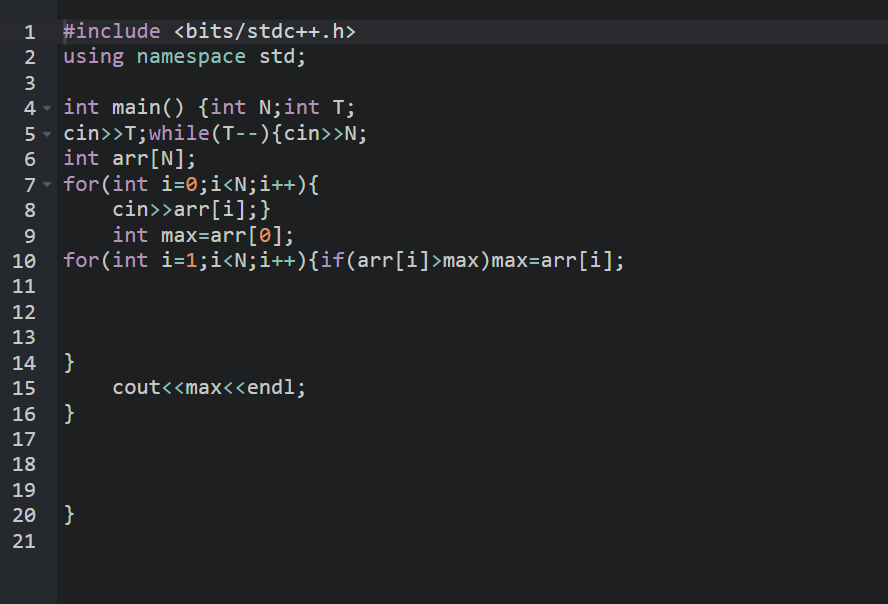
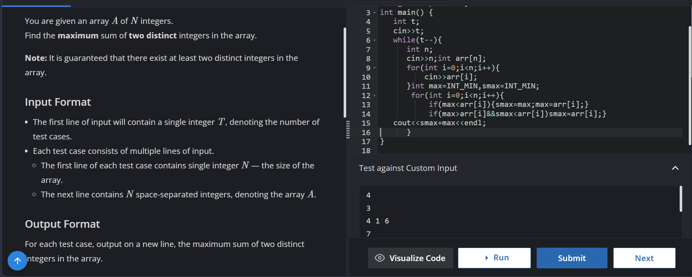

Day 1-Covered basics of git and github including cloning ,commands for git and github 
SOLVED CODECHEF QUES:650->https://www.codechef.com/practice/course/arrays/ARRAYS/problems/UWCOI20A?tab=Help 
QUES:928->https://www.codechef.com/practice/course/arrays/ARRAYS/problems/LARGESECOND?tab=solution 
PART 2 15 DAYS OF CODE 26 
DAY1:
QUE 1 ->https://leetcode.com/problems/01-matrix/submissions/2033638448/
QUE2->https://leetcode.com/problems/surrounded-regions/submissions/2033805830/
que3->https://leetcode.com/problems/number-of-enclaves/submissions/2033849482/
DAY2:
QUES 1->https://leetcode.com/submissions/detail/2035131987/
QUE2->https://leetcode.com/submissions/detail/2033889191/
que3->https://leetcode.com/problems/course-schedule/submissions/2035254750/
DAY3:
QUES 1->https://leetcode.com/problems/set-matrix-zeroes/submissions/2036406496/
ques 2->https://leetcode.com/problems/rotate-image/submissions/2036430739/
day4:
ques1->https://leetcode.com/problems/path-with-minimum-effort/submissions/2038385495/
ques 2->https://leetcode.com/submissions/detail/2037161591/
covered dijkstra algorithm
day 5:
ques 1:https://leetcode.com/problems/cheapest-flights-within-k-stops/submissions/
ques 2->https://codeforces.com/contest/1696/submission/379662604
day 6:
ques 1->https://leetcode.com/problems/number-of-ways-to-arrive-at-destination/submissions/2040947917/
ques2->https://leetcode.com/problems/network-delay-time/submissions/2041047240/
que 3->https://leetcode.com/submissions/detail/2041098810/
day 7:
que1->https://codeforces.com/contest/1883/submission/379758293
que2->https://codeforces.com/contest/1883/submission/379758293
day8->
que1->https://leetcode.com/problems/find-the-city-with-the-smallest-number-of-neighbors-at-a-threshold-distance/submissions/2041729889/
que 2->https://leetcode.com/problems/shortest-path-with-at-most-k-consecutive-identical-characters/submissions/2043363171/
day9->
que1->https://leetcode.com/problems/spiral-matrix/submissions/2044028694/
ques2->https://leetcode.com/problems/min-cost-to-connect-all-points/submissions/2045238981/
que3->https://leetcode.com/problems/number-of-provinces/submissions/2045428095/
day10
que1->https://leetcode.com/problems/number-of-operations-to-make-network-connected/submissions/2045721749/
que2->https://leetcode.com/problems/accounts-merge/submissions/2046371142/
day 11
que 1->https://leetcode.com/problems/redundant-connection/submissions/2046427680/
que 2 kruskal ->https://leetcode.com/problems/min-cost-to-connect-all-points/submissions/2046454981/
que3->https://leetcode.com/problems/maximum-points-you-can-obtain-from-cards/submissions/2047535396/
day12->

que2->https://leetcode.com/problems/longest-substring-without-repeating-characters/submissions/2047553367/
que 1->https://leetcode.com/problems/max-consecutive-ones-iii/submissions/2047781528/
que 3->https://leetcode.com/problems/most-stones-removed-with-same-row-or-column/submissions/2047908224/
day13->
que1->https://leetcode.com/problems/fruit-into-baskets/submissions/2048577582
que2->https://leetcode.com/problems/longest-substring-with-at-least-k-repeating-characters/submissions/2048637075/
que3->https://leetcode.com/problems/number-of-substrings-containing-all-three-characters/submissions/2049495864/
day14->
que1->https://leetcode.com/problems/ransom-note/submissions/2049509271/
que2->https://leetcode.com/problems/linked-list-cycle/submissions/2051237101/
que3->https://leetcode.com/problems/linked-list-cycle-ii/submissions/2051263561/
Day15->
que 1->https://leetcode.com/problems/intersection-of-two-linked-lists/submissions/2051293134/
